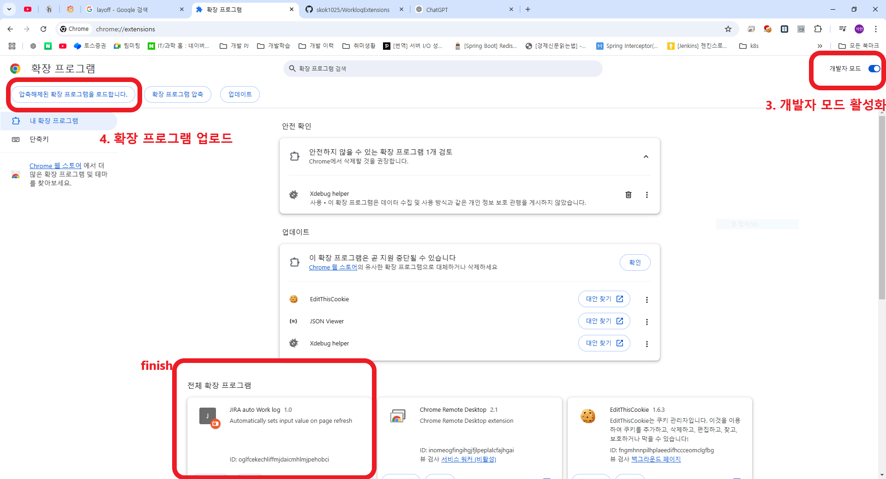

# WorkLog Extensions 사용 가이드

## 기능

- **구체적인 소요시간 측정**: 현재 진행 중인 업무에 대한 소요시간을 구체적으로 측정합니다.
- **업무 추가 및 관리**: 진행할 업무를 추가하고, 이를 시작하여 소요시간을 기록할 수 있습니다.

## 다운로드 및 설치 방법

1. **파일 압축 해제**
   - `WorkLog Extensions.zip` 파일을 다운로드한 후 압축을 해제합니다.
2. **Chrome 확장 프로그램 페이지 접속**
   - Chrome 브라우저에서 주소창에 `chrome://extensions/`를 입력하고 이동합니다.
3. **개발자 모드 활성화**
   - 오른쪽 상단의 "개발자 모드" 스위치를 클릭하여 활성화합니다.
4. **확장 프로그램 업로드**
   - "압축해제된 확장 프로그램을 로드합니다." 버튼을 클릭합니다.
   - 압축 해제한 폴더인 `WorkLog Extensions`를 선택하여 업로드합니다.

**이제 WorkLog Extensions를 활용하여 효율적으로 업무를 관리해 보세요!** 🚀

